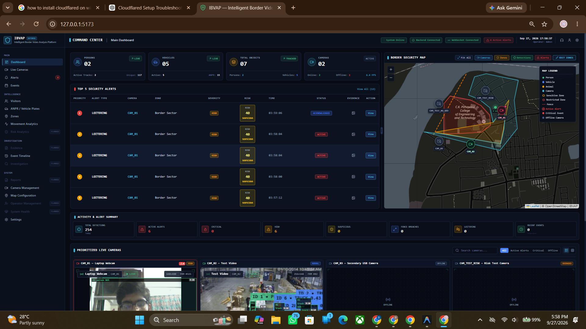
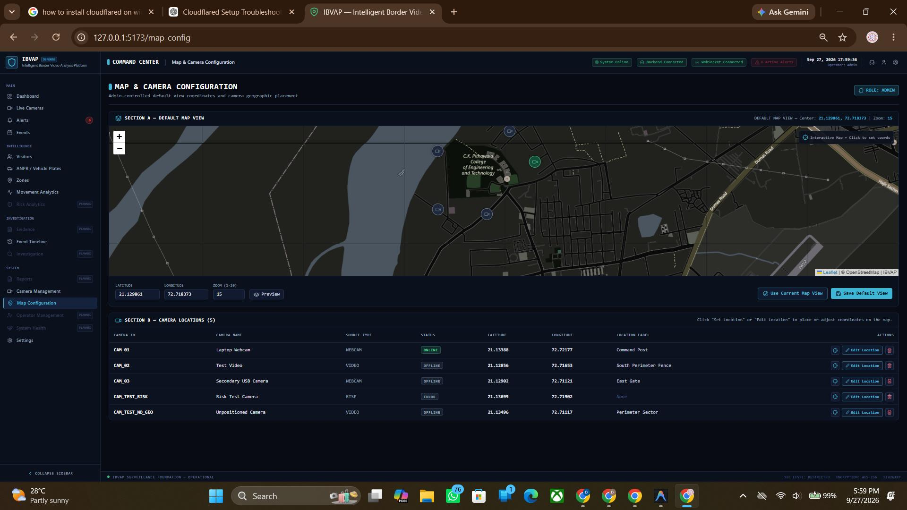
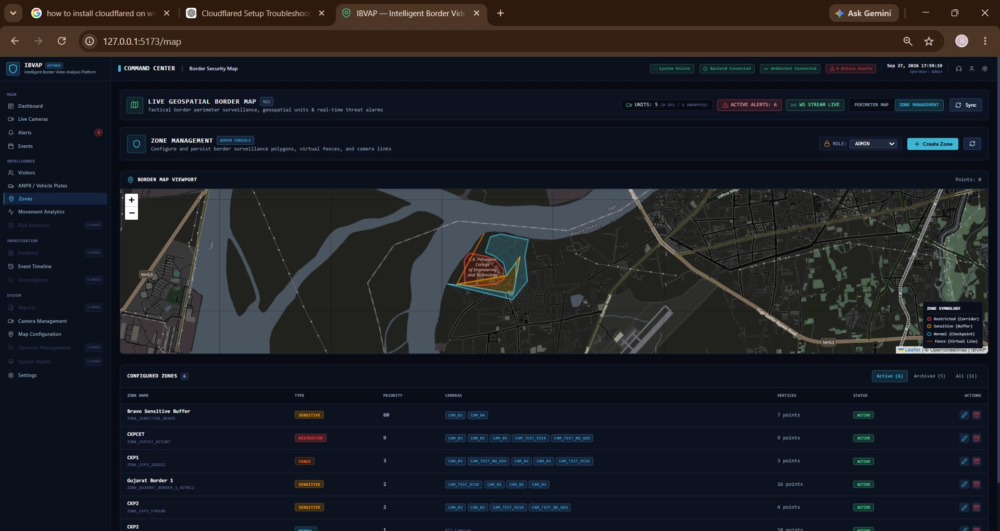

# IBVAP — Intelligent Border Video Analysis Platform

A software-only AI layer designed to upgrade existing border surveillance CCTV streams into automated, real-time intrusion and behavioral analysis feeds.

---
## 📸 Dashboard Screenshots

### Main Dashboard

<p align="center">
  
</p>

### Camera Locations

<p align="center">
  
</p>

### Zone Monitoring

<p align="center">
  
</p>

## 🏗️ Architecture Overview

The platform is divided into decoupled layers designed for modularity, scalability, and ease of testing:

```
IBVAP/
├── backend/                  # FastAPI web services, REST API, & WebSocket server
│   ├── app/
│   │   ├── api/              # API routes and versioned endpoints
│   │   ├── core/             # Application configuration & security
│   │   ├── models/           # Database models (PostgreSQL / SQLAlchemy)
│   │   ├── schemas/          # Pydantic validation schemas
│   │   ├── services/         # Stream lifecycle & alert services
│   │   └── main.py           # FastAPI entrypoint and health endpoints
│   ├── requirements.txt      # Backend Python dependencies
│   └── .env.example          # Environment variables template
│
├── ai_engine/                # Modular video analytics pipeline
│   ├── video_input.py        # RTSP stream acquisition & video file decoding
│   ├── preprocessing.py      # Resizing, color space conversions, tensor prep
│   ├── detector.py           # YOLO-based object detection
│   ├── tracker.py            # Multi-object tracking (ByteTrack)
│   ├── event_memory.py       # Temporal state cache and trajectory histories
│   ├── movement.py           # Speed, heading, bearing, and trajectory vectors
│   ├── zones.py              # Geofence polygons, restricted zones, tripwires
│   ├── rules.py              # Behavior rules (intrusion, loitering, wrong-way)
│   ├── alerts.py             # Alert categorization, priority, and snapshot binding
│   └── pipeline.py           # End-to-end stream analytics coordinator
│
├── frontend/                 # Web dashboard (React 18, Vite, Tailwind CSS, Leaflet)
├── videos/                   # Raw CCTV recordings and test footage
├── evidence/                 # Snapshot frames, cropped targets, & alert video clips
├── tests/                    # Unit, integration, and pipeline tests
├── .gitignore                # Version control ignore definitions
└── README.md                 # Project documentation
```

---

## 🛠️ Planned Technology Stack

- **AI Engine**: Python 3.11+, OpenCV, NumPy, PyTorch, Ultralytics YOLO, ByteTrack
- **Backend**: FastAPI, Uvicorn, PostgreSQL, SQLAlchemy, Pydantic, WebSockets
- **Frontend**: React 18, Vite, Tailwind CSS, Leaflet / react-leaflet
- **Storage**: Local filesystem for media/evidence, PostgreSQL for alerts and metadata

---

## 🚀 Quick Start (Foundation Setup)

### 1. Prerequisites
- Python 3.11+ installed

### 2. Create and Activate Virtual Environment

**Windows (PowerShell):**
```powershell
python -m venv .venv
.venv\Scripts\Activate.ps1
```

**Linux / macOS:**
```bash
python3 -m venv .venv
source .venv/bin/activate
```

### 3. Install Dependencies
```bash
pip install -r backend/requirements.txt
```

### 4. Configure Environment Variables
Copy the template configuration file:
```bash
cp backend/.env.example backend/.env
```

### 5. Start the Backend Server
Run Uvicorn from the `backend/` directory:
```bash
# From workspace root
.venv\Scripts\python -m uvicorn app.main:app --app-dir backend --host 127.0.0.1 --port 8000 --reload
```
Or directly navigate to `backend/`:
```bash
cd backend
uvicorn app.main:app --reload
```

---

## 🔍 Verification & Health Checks

Once the backend is running, verify service health:

- **Root Endpoint**: [http://127.0.0.1:8000/](http://127.0.0.1:8000/)
  ```json
  {
    "status": "online",
    "platform": "IBVAP",
    "description": "Intelligent Border Video Analysis Platform",
    "version": "0.1.0"
  }
  ```

- **Health Endpoint**: [http://127.0.0.1:8000/health](http://127.0.0.1:8000/health)
  ```json
  {
    "status": "healthy",
    "service": "IBVAP Backend API",
    "version": "0.1.0",
    "environment": "development"
  }
  ```

- **Interactive API Documentation (Swagger UI)**: [http://127.0.0.1:8000/docs](http://127.0.0.1:8000/docs)

### Run Automated Tests
```bash
.venv\Scripts\python -m unittest discover -s tests
```
